# 🚗 Smart Parking Management System 

## 📌 Project Overview
This is a full-stack Smart Parking Management System built using Flask, MySQL, HTML, CSS, and JavaScript.  
It allows users to search parking areas, book slots based on date and time, and generate QR codes for entry and exit.  
The system also includes an admin dashboard for managing parking areas and bookings.

---

## ✨ Features

### 👤 User Features
- User registration and login system
- Search parking by city
- View available parking slots
- Book parking based on date and time
- Real-time slot availability check
- QR code generation for booking
- Check-in and check-out using QR scan

### 🧑‍💼 Admin Features
- Secure admin login
- Add / Edit / Delete parking areas
- Manage cities and slots
- View all bookings

## 🛠 Tech Stack

### ⚛️ Frontend
- HTML
- CSS
- JavaScript
- Jinja2 Templates (Flask)

### 🐍 Backend
- Python
- Flask
- QR Code Generator (`qrcode` library)

### 🗄️ Database
- MySQL

## 📸 Screenshots

### 📝 Registration Page
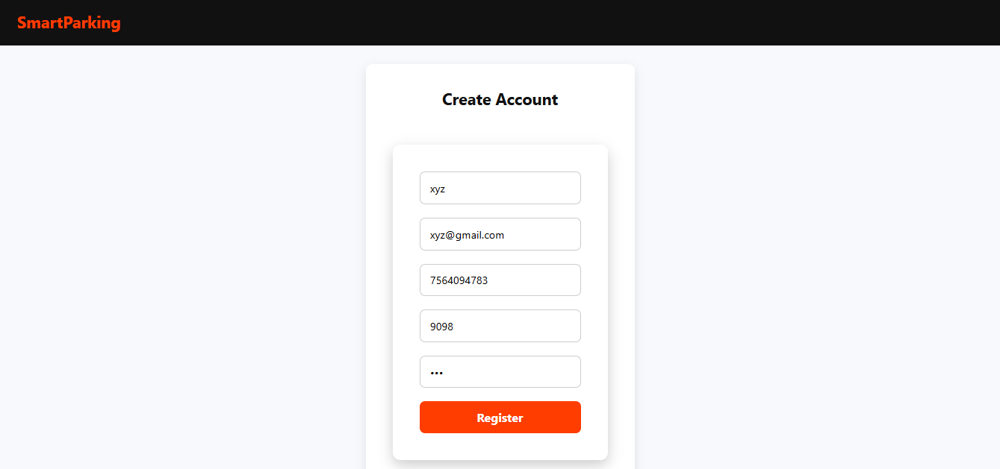

### 🔐 Login Page
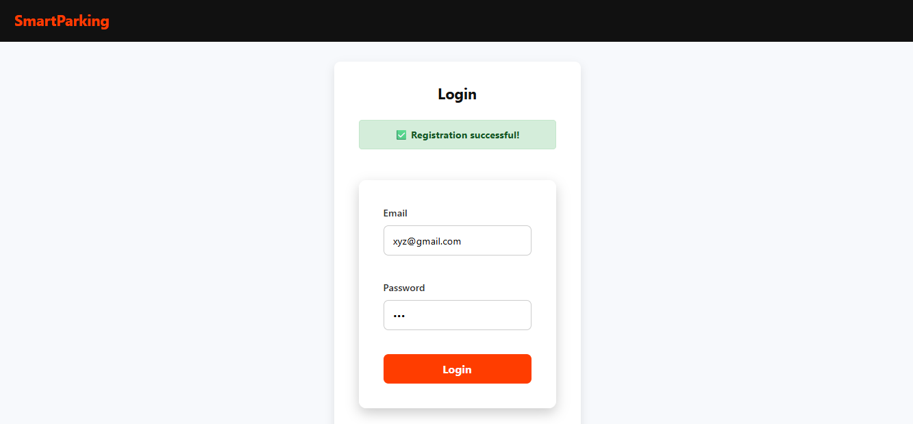

### 🏠 Search City Page (Home Page)
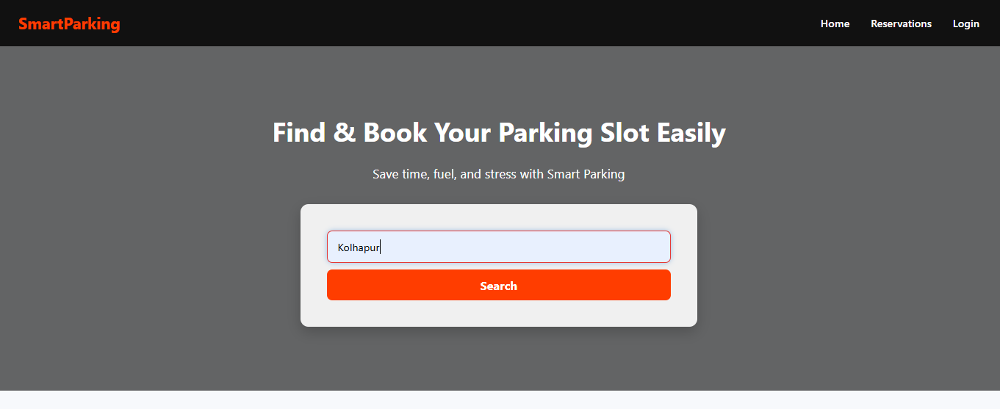

### 🚗 Parking Results & Total Slots
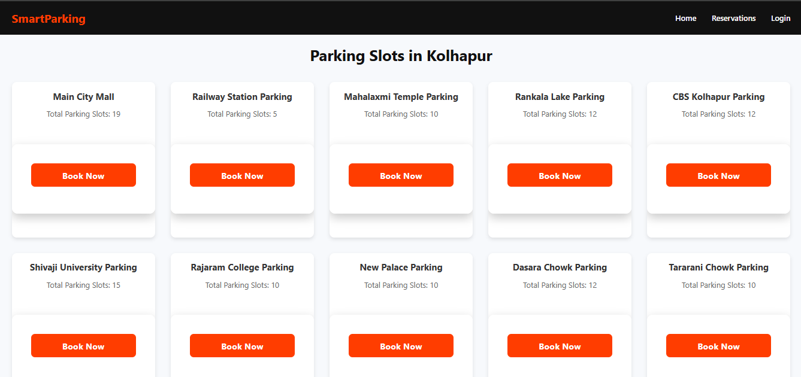

### 📅 Time Selection
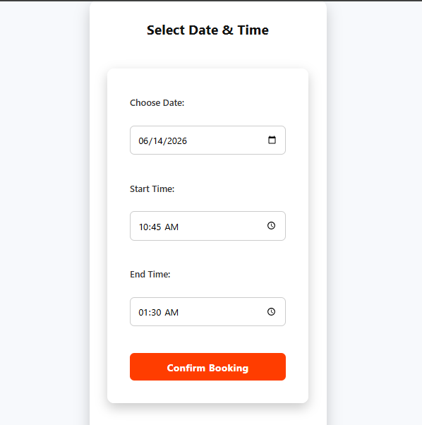

### 🅿️ Slot Selection
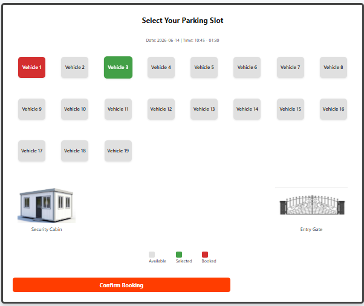

### 🎫 Booking Ticket & QR Code
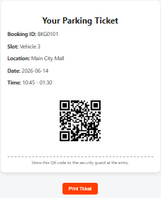

### ✅ Check-In & Check-Out

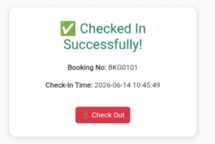

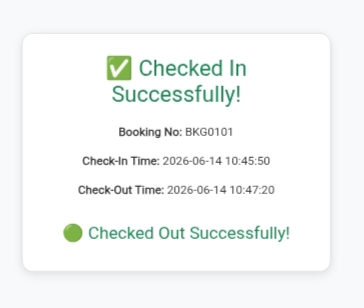

### 🧑‍💼 Admin Dashboard
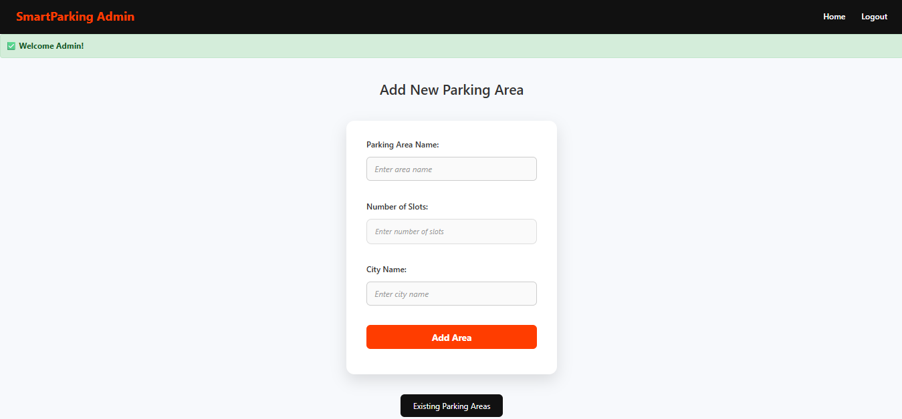

### ⚙️ Manage Parking Areas
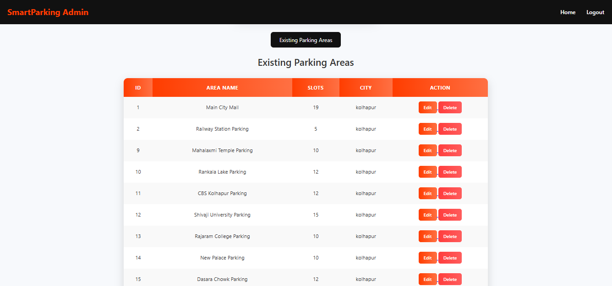
